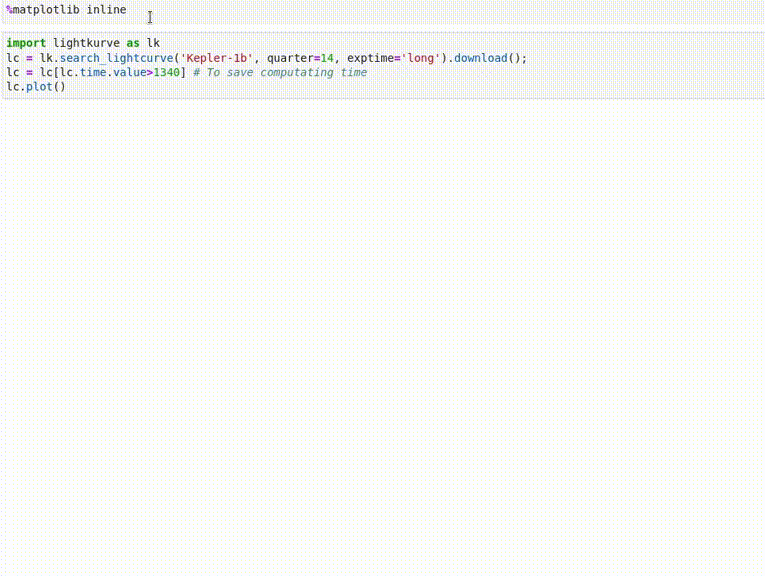

.. Deep-Transit documentation master file, created by
   sphinx-quickstart on Mon Jul 12 18:03:47 2021.
   You can adapt this file completely to your liking, but it should at least
   contain the root `toctree` directive.

Welcome to Deep-Transit's documentation!
========================================

.. toctree::
   :maxdepth: 2
   :caption: Contents:
   :numbered:

   installation.rst
   notebooks/Quickstart.ipynb
   notebooks/Detection.ipynb
   notebooks/Train.ipynb
   reference.rst

Indices and tables
==================

* :ref:`genindex`
* :ref:`modindex`
* :ref:`search`
